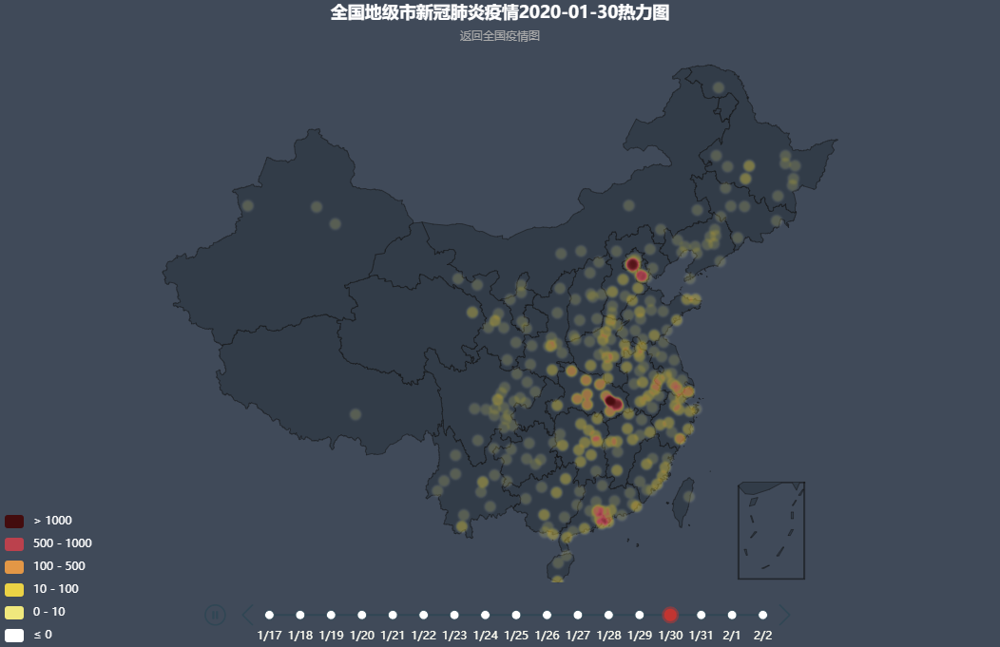

# 2019-nCoV疫情可视化

本项目基于echart制作了随时间变化的疫情热力图，数据来源于

## 查看方式
* 1.2019-nCoV 疫情可视化已经部署到阿里云上，可以直接访问 。每十五分钟自动更新。
* 2.本地部署，python3 generate_js.py # 这一步会从财新网获得地级市的疫情确认数，之后写入到 confirmed_datas.js
open heatmaps.html

## 效果

