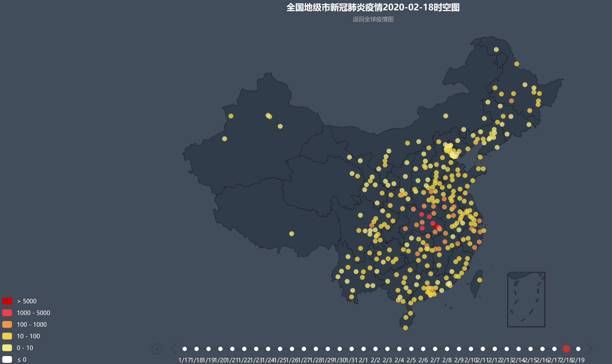
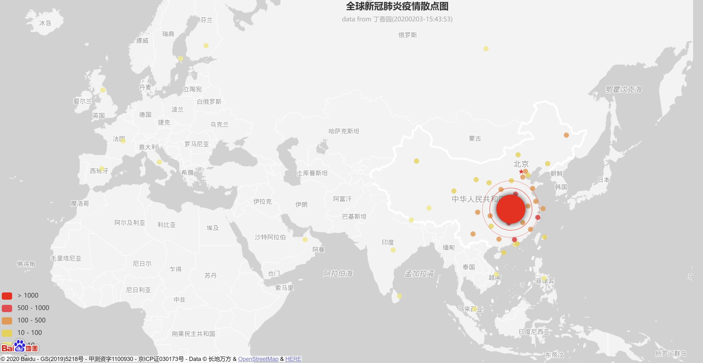

# 2019-nCoV疫情可视化

本项目基于echart制作了随时间变化的全国地级市疫情时空图,基于百度地图制作了全球新冠肺炎疫情散点图和北京、上海、天津市确诊病例活动区域图，为新型冠状肺炎疫情的分析和个人健康防护服务。

## 数据来源
* 财新网(http://datanews.caixin.com/interactive/2020/iframe/pneumonia-new/)
* 丁香园(https://3g.dxy.cn/newh5/view/pneumonia/)
* 腾讯网(https://view.inews.qq.com/g2/getOnsInfo?name=disease_h5)
* 孝感日报(http://www.xgrb.cn/)
* 首都之窗(http://www.beijing.gov.cn/)

## 查看方式
* 1.2019-nCoV 疫情可视化已经部署到阿里云上，可以直接访问 [疫情热力图](http://nwatch.top:8085/2019ncov/heatmaps.html) 、[疫情散点图](http://nwatch.top:8085/2019ncov/index.html)。每十五分钟自动更新。
* 2.本地部署，python3 generate_js.py # 这一步会从财新网获得地级市的疫情确认数，之后写入到 confirmed_datas.js
open heatmaps.html 疫情时空图
open effectScatter-bmap.html 疫情散点图
open bj_Geocoder.html 北京病例活动区域图

## 效果
疫情时空图

疫情散点图

